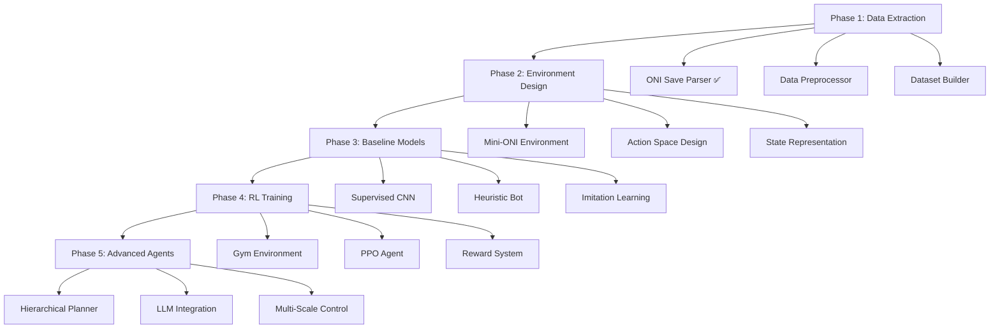

# Design Document: ONI AI Agent

## Overview

This document outlines the technical design for an AI agent system capable of playing Oxygen Not Included (ONI), a complex colony simulation game. The system follows a phased approach, progressing from data extraction and supervised learning to a full reinforcement learning agent with hierarchical planning capabilities.

The architecture is designed to leverage modern ML frameworks (PyTorch, Stable Baselines3) and high-performance computing resources (DGX Spark) while maintaining modularity and extensibility for research experimentation.

## Architecture

The system consists of five main phases, each building upon the previous:



**Implementation Notes**: The ONI Save Parser includes compatibility patches for newer Node.js versions and enhanced error handling with mock data generation for development/testing purposes.

## Components and Interfaces

### Phase 1: Data Extraction Pipeline

**ONI Save Parser**
- **Interface**: `parse_save(file_path: str) -> GameState`
- **Implementation**: Wraps the existing [oni-save-parser](https://github.com/RoboPhred/oni-save-parser) JavaScript library
- **Data Extraction**: Grid tiles, elements, temperatures, buildings, duplicant status, cycle information
- **Output Format**: Structured Python objects with numpy arrays for efficient processing

**Data Preprocessor**
- **Interface**: `preprocess_state(game_state: GameState) -> StateTensor`
- **Functionality**: Converts raw game data into ML-ready tensors
- **State Representation**: Height × Width × Channels format where channels include:
  - Material state (solid/liquid/gas) - 3 channels
  - Element ID - 1 channel (categorical, one-hot encoded)
  - Temperature - 1 channel (normalized)
  - Building type - 1 channel (categorical, one-hot encoded)
  - Duplicant positions - 1 channel
- **Normalization**: Temperature ranges, element IDs, building types standardized

**Dataset Builder**
- **Interface**: `build_dataset(save_files: List[str]) -> Dataset`
- **Storage Formats**: JSON for metadata, NPZ for tensor data, Parquet for tabular features
- **Labels**: Colony survival status, resource counts, stress levels, cycle progression
- **Augmentation**: Rotation, cropping for spatial invariance

### Phase 2: Environment Design

**Mini-ONI Environment**
- **Scope**: Rectangular starter base (64x64 tiles maximum)
- **Objectives**: 
  - Primary: Maintain oxygen above 500g/tile in living areas
  - Secondary: Route polluted water through water sieve
  - Tertiary: Maintain duplicant happiness above 50%
- **Building Restrictions**: Limited to essential buildings (10-15 types)
- **Time Horizon**: 100 cycles maximum per episode

**Action Space Design**
- **High-Level Actions**: Coarse commands to avoid micromanagement
- **Action Types**:
  - `PlaceBuildingAction(building_type, region)` - Place building in specified area
  - `DigAction(region, material_type)` - Excavate specified region
  - `PriorityAction(task_type, priority_level)` - Set task priorities
  - `DuplicantAction(duplicant_id, skill_assignment)` - Assign skills/jobs
- **Action Space Size**: ~200 discrete actions (manageable for RL)

**State Representation**
- **Grid State**: Downscaled 32x32 multi-channel tensor
- **Global Features**: Resource counts, duplicant stats, cycle number (64-dimensional vector)
- **Attention Mechanism**: Focus on critical areas (low oxygen, high temperature)

### Phase 3: Baseline Models

**Supervised CNN Model**
- **Architecture**: ResNet-18 backbone with custom head
- **Input**: 32x32x8 state tensor
- **Output**: Building placement probabilities per tile
- **Training**: Cross-entropy loss on human placement decisions
- **Augmentation**: Spatial transformations, noise injection

**Heuristic Bot**
- **Rule Engine**: Priority-based decision system
- **Problem Detection**:
  - Oxygen levels below threshold → Place oxygen diffuser
  - High temperature → Install cooling system
  - No toilets → Build lavatory
  - Food shortage → Expand farming
- **Template System**: Pre-defined room layouts and building patterns
- **Decision Tree**: Hierarchical rule evaluation with conflict resolution

**Imitation Learning Pipeline**
- **Data Collection**: State-action pairs from heuristic bot trajectories
- **Model**: Behavioral cloning with DAgger for iterative improvement
- **Loss Function**: Cross-entropy for discrete actions, MSE for continuous parameters

### Phase 4: RL Training Environment

**Gym Environment Wrapper**
- **Interface**: Standard OpenAI Gym API
  - `step(action) -> (observation, reward, done, info)`
  - `reset() -> observation`
  - `render(mode='human') -> None`
- **Implementation Options**:
  - **Option A**: Custom ONI simulator (preferred for speed)
  - **Option B**: C# mod for real ONI game with file-based communication
- **Parallel Environments**: 16-32 environments for sample efficiency

**PPO Agent Configuration**
- **Framework**: Stable Baselines3 with PyTorch backend
- **Network Architecture**:
  - **Policy Network**: CNN feature extractor + MLP head
  - **Value Network**: Shared CNN features + separate value head
- **Hyperparameters**:
  - Learning rate: 3e-4 with cosine annealing
  - Batch size: 256
  - PPO clip ratio: 0.2
  - GAE lambda: 0.95
  - Entropy coefficient: 0.01

**Reward System Design**
- **Dense Rewards** (per step):
  - +0.1 per tile with breathable oxygen (>500g)
  - +0.05 per duplicant with happiness >50%
  - +0.02 per unit of stored food/water
  - -0.1 per tile with dangerous temperature (>40°C or <0°C)
- **Sparse Rewards** (episodic):
  - +100 for surviving 100 cycles
  - -50 for duplicant death
  - +20 for completing infrastructure milestones
- **Reward Shaping**: Potential-based shaping to maintain optimality

### Phase 5: Advanced Representations

**Hierarchical Planning Architecture**
- **High-Level Planner**: Sets abstract goals (e.g., "build electrolyzer room")
- **Mid-Level Controller**: Decomposes goals into building sequences
- **Low-Level Executor**: Handles precise placement and timing
- **Communication**: Goal embeddings passed between levels

**LLM Integration**
- **Model**: Local deployment of Code Llama or similar (7B parameters)
- **Input**: Natural language state summaries
- **Output**: Structured build plans in JSON format
- **Integration**: LLM suggestions filtered through feasibility checker

## Data Models

### Core Data Structures

```python
@dataclass
class GameState:
    grid: np.ndarray  # (height, width, channels)
    duplicants: List[Duplicant]
    resources: Dict[str, float]
    buildings: List[Building]
    cycle: int
    timestamp: float

@dataclass
class StateTensor:
    spatial: np.ndarray  # (32, 32, 8) normalized grid
    global_features: np.ndarray  # (64,) global state vector
    mask: np.ndarray  # (32, 32) valid action mask

@dataclass
class Action:
    action_type: ActionType
    parameters: Dict[str, Any]
    target_region: Tuple[int, int, int, int]  # (x1, y1, x2, y2)
```

### Database Schema

**Training Data Storage**
- **States Table**: Compressed state tensors with metadata
- **Actions Table**: Action sequences with timestamps
- **Episodes Table**: Episode-level statistics and outcomes
- **Models Table**: Model checkpoints with performance metrics

## Error Handling

**Data Pipeline Errors**
- **Corrupted Save Files**: Skip with logging, continue processing
- **Parsing Failures**: Fallback to previous save version
- **Memory Issues**: Batch processing with configurable chunk sizes

**Training Errors**
- **Environment Crashes**: Automatic environment reset
- **Model Divergence**: Gradient clipping and learning rate reduction
- **Hardware Failures**: Checkpoint-based recovery system

**Runtime Errors**
- **Invalid Actions**: Action masking and constraint checking
- **State Inconsistencies**: State validation and correction
- **Performance Degradation**: Automatic model rollback

## Testing Strategy

A property is a characteristic or behavior that should hold true across all valid executions of a system—essentially, a formal statement about what the system should do. Properties serve as the bridge between human-readable specifications and machine-verifiable correctness guarantees.

### Property-Based Testing with Hypothesis

The system will use Python's Hypothesis library for property-based testing, which automatically generates test cases to verify universal properties across diverse inputs.

**Testing Framework Configuration**:
- **Library**: Hypothesis for property-based testing
- **Iterations**: Minimum 100 iterations per property test
- **Integration**: pytest for test discovery and execution
- **Coverage**: Property tests complement unit tests for comprehensive validation

### Correctness Properties

Based on the requirements analysis, the following properties must hold for the ONI AI system:

**Property 1: Save File Processing Round-Trip**
*For any* valid ONI save file, parsing then serializing to ML format then deserializing should preserve all essential game state information (grid, duplicants, resources, buildings, cycle)
**Validates: Requirements 1.1, 1.2, 1.3**

**Property 2: Batch Processing Consistency**
*For any* collection of valid save files, processing them in batch should produce the same results as processing them individually
**Validates: Requirements 1.4**

**Property 3: State Tensor Format Invariant**
*For any* processed game state, the output tensor should have dimensions (height, width, channels) with correct data types and value ranges for each channel
**Validates: Requirements 1.5, 2.4**

**Property 4: Environment Constraint Enforcement**
*For any* action taken in the mini-ONI environment, the system should only operate within the defined rectangular boundaries and use only the allowed building subset
**Validates: Requirements 2.1, 2.5**

**Property 5: Objective Function Consistency**
*For any* game state, the objective evaluation (oxygen levels, resource thresholds) should produce consistent boolean results when applied multiple times
**Validates: Requirements 2.2**

**Property 6: Action Space Abstraction Level**
*For any* generated action, it should operate at the coarse, high-level abstraction (regions, not individual cells) as specified in the design
**Validates: Requirements 2.3**

**Property 7: Model Prediction Validity**
*For any* input state tensor, the CNN model should output valid probability distributions (sum to 1, non-negative values) over building types for each tile
**Validates: Requirements 3.1, 3.2**

**Property 8: Heuristic Bot Problem Detection**
*For any* game state with identifiable problems (low oxygen, high temperature, missing facilities), the heuristic bot should detect and flag these issues
**Validates: Requirements 3.3**

**Property 9: Rule-Based Response Consistency**
*For any* detected problem condition, the heuristic bot should apply the same template-based solution when encountering identical conditions
**Validates: Requirements 3.4**

**Property 10: Trajectory Data Completeness**
*For any* generated trajectory from the heuristic bot, it should contain complete state-action-result tuples with valid transitions
**Validates: Requirements 3.5**

**Property 11: Environment Interface Compliance**
*For any* action passed to the environment step function, it should return a valid tuple (observation, reward, done, info) with correct types
**Validates: Requirements 4.1**

**Property 12: File Communication Protocol**
*For any* state dump or action file operation, the data should be complete, parseable, and maintain consistency between write and read operations
**Validates: Requirements 4.2**

**Property 13: Reward Function Monotonicity**
*For any* two game states where state A has better conditions (more oxygen, happier duplicants, more resources) than state B, the reward for state A should be greater than or equal to state B
**Validates: Requirements 4.4, 4.5**

**Property 14: Parallel Environment Independence**
*For any* set of parallel environments running the same scenario, they should produce statistically similar results without interference between instances
**Validates: Requirements 5.1, 5.5**

**Property 15: Off-Policy Learning Consistency**
*For any* logged trajectory, training from it should produce learning progress comparable to online training with similar data
**Validates: Requirements 5.2**

**Property 16: Evaluation Protocol Fairness**
*For any* agent comparison, using the same fixed scenarios should produce consistent relative performance rankings across multiple evaluation runs
**Validates: Requirements 5.3**

**Property 17: Hierarchical Abstraction Preservation**
*For any* high-level goal passed to the hierarchical system, the decomposition into lower-level actions should maintain semantic consistency with the original goal
**Validates: Requirements 6.2, 6.4**

**Property 18: Feature Extraction Completeness**
*For any* game state, higher-level features (rooms, systems, networks) should be correctly identified and represented when present
**Validates: Requirements 6.1**

**Property 19: LLM Integration Validity**
*For any* state summary provided to the LLM, the generated build plan should be syntactically valid and executable within the game constraints
**Validates: Requirements 6.3**

**Property 20: Data Management Round-Trip**
*For any* dataset or model checkpoint, the export-import cycle should preserve all essential data and metadata without corruption
**Validates: Requirements 7.1, 7.2, 7.4, 7.5**

**Property 21: Experiment Logging Completeness**
*For any* training run, all specified metadata (hyperparameters, curves, results) should be logged and retrievable
**Validates: Requirements 7.3**

**Property 22: Metrics Collection Accuracy**
*For any* game state, the calculated metrics (survival, efficiency, progress) should accurately reflect the actual game conditions
**Validates: Requirements 8.1, 8.2, 8.4**

**Property 23: Benchmark Consistency**
*For any* standardized benchmark scenario, multiple runs should produce results within expected statistical variance
**Validates: Requirements 8.3**

**Property 24: Failure Mode Classification**
*For any* failed episode, the system should correctly identify and categorize the primary failure mode (oxygen, temperature, starvation, etc.)
**Validates: Requirements 8.5**

### Unit Testing Strategy

**Complementary Testing Approach**:
- **Unit Tests**: Focus on specific examples, edge cases, and integration points
- **Property Tests**: Verify universal properties across randomized inputs using Hypothesis
- **Integration Tests**: Test end-to-end workflows and component interactions

**Unit Test Coverage**:
- Save file parsing with known good/bad examples
- State tensor generation with specific game states  
- Reward function calculation with designed scenarios
- Heuristic bot responses to crafted problem states
- Environment step function with boundary conditions
- Model loading/saving with checkpoint files

**Property Test Configuration**:
- Minimum 100 iterations per property test
- Custom Hypothesis strategies for generating valid game states, actions, and save files
- Shrinking enabled to find minimal failing examples
- Integration with pytest for test discovery and reporting

**Test Data Management**:
- Curated collection of representative save files for testing
- Synthetic data generators for edge cases
- Performance benchmarks for regression testing
- Continuous integration with automated test execution